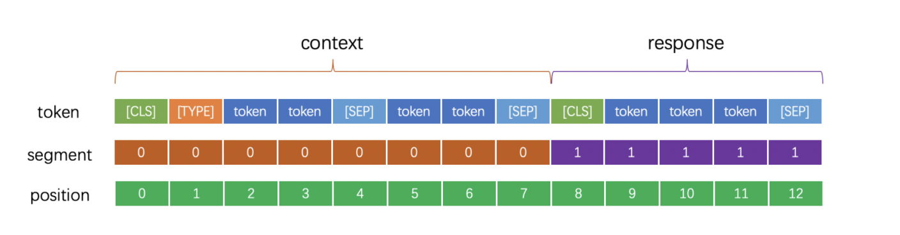

# LICS2021 多技能对话

## 1. 项目&任务介绍

本项目基于官方给定的baseline（[**lics2021_baseline**](https://github.com/PaddlePaddle/PaddleNLP/tree/release/2.0-rc/examples/dialogue/lic2021_baseline)）进行二次改造，对整个代码框架做了重构，对数据加载部分做了注释说明，一些小的细节也做了改进，最终B榜的排名为11名。

本次任务为[2021语言与智能技术竞赛](http://lic2021.ccf.org.cn/)：多技能对话任务，真实世界的人机交互同时涉及到多种对话技能，比如知识对话、推荐对话等。在人机对话中如何自然地融合多个对话技能，从而有效地提升用户体验，是一个重要的挑战。

本次任务则需要构建一个**对话系统**，使其可以具备如下三种对话能力：

- 知识对话

  是否可以生成流畅的、与角色信息一致的对话回复。

  - 输入：对话目标g(部分数据集没有)、知识信息M、对话历史H(u_1, u_2, …, u_t-1)
  - 输出：符合对话历史和对话目标，且自然流畅、信息丰富的机器回复u_t。

- 推荐对话

  是否可以在对话过程中充分利用**外部知识**，并且在生成对话回复的过程中引入外部知识。

  - 输入：第一个对话目标g_1、最后两个对话目标g_L-1和g_L、知识信息M、用户Profile (画像)P、对话场景S、对话历史H(u_1, u_2, …, u_t-1)
  - 输出：符合对话历史和对话目标序列，且自然流畅、信息丰富的机器回复u_t。

- 画像对话

  是否可以在对话过程中基于用户兴趣以及用户的实时反馈，主动对用户做出推荐。

  - 输入：机器画像信息，对话历史H(u_1, u_2, …, u_t-1)
  - 输出：符合对话历史和画像信息，且自然流畅、信息丰富的机器回复u_t。

## 2. 数据介绍

本次比赛官方提供了九份开源的中文对话数据，大致介绍如下，

| 对话技能名称 |                  数据集                   | 训练集样例数量 | 开发集样例数量 | 测试集样例数量 | 单／多轮 |                  领域                   |
| :----------: | :---------------------------------------: | :------------- | :------------- | :------------- | :------- | :-------------------------------------: |
|   知识对话   |                百度DuConv                 | 19858          | 2000           | 5000           | 多轮     |                  电影                   |
|   推荐对话   |               百度DuRecDial               | 6618           | 946            | 4645           | 多轮     | 明星、电影、音乐、新闻、天气、美食、POI |
|   画像对话   | 百度画像数据集(Chinese Persona Chat, CPC) | 23000          | 1500           | 3000           | 多轮     |                 开放域                  |
|     其他     |                 微博数据                  | 3103764        | 443394         | 886790         | 单轮     |                 开放域                  |
|     其他     |               豆瓣多轮对话                | 500000         | 25001          | 1186           | 单轮     |                 开放域                  |
|     其他     |                 清华LCCC                  | 11987759       | 20000          | 10000          | 多轮     |                 开放域                  |
|     其他     |              清华情感数据集               | 899207         | 110000         | 110000         | 单轮     |                 开放域                  |
|     其他     |        腾讯检索辅助生成对话数据集         | 5498480        | 107332         | 156706         | 单轮     |                 开放域                  |
|     其他     |                清华KdConv                 | 3000           | 300            | 2751           | 多轮     |            电影、音乐、旅游             |

训练集和开发集以session形式组织，每个session包括对话目标序列、对话相关的背景知识、对话场景、用户Profile和对话内容；测试集以样本形式组织，每个样本包括对话第1个目标和最后2个目标、对话相关的背景知识、对话场景、用户Profile和对话历史，要求模型输出机器角色的回复。数据中，各部分介绍如下：

1. 对话目标序列 : 给定了session的话题转移路径；
2. 用户Profile：包括用户的一些个人信息、领域偏好和实体偏好；
3. 相关知识信息（knowledge）：提供了对话所需的所有SPO形式的背景知识；
4. 对话场景：包括聊天的时间、地点和主题等；
5. 对话内容：完整的机器和用户对话序列；
6. 对话历史：从首轮开始到当前机器角色回复之前的对话内容，如果当前机器角色的回复为首轮，则对话历史为空。

### 2.1 百度DuConv（知识对话）

每一个样本代表一个json串，json串中共包含三个key，分别为`goal`、`knowledge`和`conversation`

- `conversation`

  代表整个对话的过程，由数组存储，数组中每个元素代表一句话，整个数组代表一个对话过程。

- `knowledge`

  代表一些知识的信息，由数组存储，数组中每个元素有SPO三元组组成。

- `goal`

  代表了对话所围绕的主题以及主题的信息，由数组存储，表示主题的内容和主题的信息。

下面以一个例子为代表，

```json
{
  'goal':
		[['START', '闹事者', '神探 蒲松龄 之 兰若 仙踪'],
     ['闹事者', '类型', '喜剧'],
     ['神探 蒲松龄 之 兰若 仙踪', '类型', '喜剧']],
 'knowledge': 
  	[['闹事者', '是否 上映', '已 上映'],
  	 ['闹事者', '国家', '俄罗斯'],
  	 ['闹事者', '导演', 'Mariya Mak hanko'],
  	 ['闹事者', '类型', '喜剧'],
  	 ['闹事者', '领域', '电影'],
  	 ['神探 蒲松龄 之 兰若 仙踪', '是否 上映', '未 上映'],
  	 ['神探 蒲松龄 之 兰若 仙踪', '类型', '古装'],
  	 ['神探 蒲松龄 之 兰若 仙踪', '口碑', '口碑 很 差'],
  	 ['神探 蒲松龄 之 兰若 仙踪', '类型', '喜剧'],
  	 ['神探 蒲松龄 之 兰若 仙踪', '领域', '电影'],
  	 ['闹事者', '发布 日期 信息', '5 年前 上映'],
  	 ['闹事者', '主演', 'Mikhail Grebenshikov']],
 'conversation': 
  	 ['你好 ， 在 看 什么 电影 吗 ？',
      '没有 ， 你 可以 推荐 一部 。',
      '《 闹事者 》 5 年前 上映 的 ， 主演 是 Mikhail Grebenshikov 您 有 时间 可以 看一下 。',
      '好 的 ， 有 时间 一定 去 看 。',
      '我 再 给 你 推荐 一部 喜剧 电影 ， 叫 神探 蒲松龄 之 兰若 仙踪 。',
      '这个 我 有 听 朋友 说过 。',
      '是 个 古装片 ， 虽然 口碑 不是 很好 ， 不过 我 觉得 值得 一看 哦 ！',
      '但是 我 可能 不是 很 感兴趣 。']}
```

### 2.2 百度DuRecDial（推荐对话）

每一个样本代表一个json串，json串中共包含五个key，分别为`situation`、`goal`、`user_profile`、`knowledge`和`conversation`

- `situation`

  一个字符串，指定会话的背景，比如聊天的时间、地点、主题等

- `goal`

  一个字符串，对会话内容的要求

- `user_profile`

  map结构，用户的画像，key为属性、value为取值

- `knowledge`

  同上面的三元组信息，代表一些知识的信息，由数组存储，数组中每个元素有SPO三元组组成。

- `conversation`

  代表整个对话的过程，由数组存储，数组中每个元素代表一句话，整个数组代表一个对话过程。

下面以一个例子代表，

```json
{
  'situation': '聊天 时间 : 晚上 22 : 00 ， 在 家里',
  'goal': '[1] 问答 ( User 主动 问 电影   『 导火线 』   主演 是 谁 ?   Bot 回答 『 范冰冰 』 ， User 满足 并 好评 ) --> [2] 关于 明星 的 聊天 ( Bot 主动 ， 根据 给定 的 明星 信息 聊   『 范冰冰 』   相关 内容 ， 至少 要 聊 2 轮 ， 避免 话题 切换 太 僵硬 ， 不够 自然 ) --> [3] 电影 推荐 ( Bot 主动 ， Bot 使用   『 手机 』   的 某个 评论 当做 推荐 理由 来 推荐   『 手机 』 ， User 先问 电影 『 国家 地区 、 导演 、 类型 、 主演 、 口碑 、 评分 』 中 的 一个 或 多个 ， Bot 回答 ， 最终 User 接受 ) --> [4] 再见',
 'user_profile': {'姓名': '徐玲琴',
  '性别': '女',
  '居住地': '佛山',
  '年龄区间': '26-35',
  '职业状态': '学生',
  '喜欢 的 明星': ['范冰冰'],
  '喜欢 的 电影': ['手足情'],
  '喜欢 的 新闻': ['范冰冰 的新闻'],
  '同意 的 美食': '红烧肉',
  '同意 的 poi': '洞庭湖湘菜馆',
  '拒绝': ['音乐'],
  '接受 的 电影': ['我不是潘金莲', '导火线', '爱情呼叫转移'],
  '没有接受 的 电影': ['万物生长']},
 'knowledge': [['范冰冰', '主演', '导火线'],
  ['范冰冰', '主演', '手机'],
  ['导火线', '评论', '我 当 警察 这么 多年 有没有 抓 错过 人 ？ 留给 法官 回答'],
  ['导火线', '评论', '甄子丹 动作片 里 的 经典之作 ！'],
  ['导火线', '评论', '还 不错 。 有些 镜头 有 印象 。'],
  ['导火线', '评论', '一个 警察 和 一个 卧底 对付 三个 坏人'],
  ['导火线', '评论', '打 得 很漂亮 。 。'],
  ['手机', '评论', '现在 看来 也 是 不 落伍 的 ， 还有我 觉得 一个 好 的 演员 要 看 他 怎么 开车 ！'],
  ['手机', '评论', '对 ， 啊 ， 行 ， 噢 ， 啊 ， 嗨'],
  ['手机', '评论', '重温 经典 ， 感觉 不错 ！'],
  ['手机', '评论', '现实 批判主义'],
  ['手机', '评论', '冯导 的 喜剧 永远 都 有 葛优 的 幽默'],
  ['手机', '国家地区', '中国'],
  ['手机', '导演', '冯小刚'],
  ['手机', '类型', '剧情   喜剧'],
  ['手机', '主演', '葛优   范冰冰   徐帆   张国立'],
  ['手机', '口碑', '口碑 还好'],
  ['手机', '评分', '7.2'],
  ['范冰冰', '获奖', '大众 电影 百花奖 _ 最佳 女主角'],
  ['范冰冰', '获奖', '台湾 电影 金马奖 _ 金马奖 - 最佳 女 配角奖'],
  ['范冰冰', '获奖', '香港电影 金像奖 _ 金像奖 - 最佳 女配角'],
  ['范冰冰', '获奖', '华语 电影 传媒 大奖 _ 最佳 女演员'],
  ['范冰冰', '获奖', '华语 电影 传媒 大奖 _ 最佳 女配角'],
  ['范冰冰', '出生地', '中国   山东   青岛'],
  ['范冰冰', '简介', '娱乐圈 黄金 剩 女明星'],
  ['范冰冰', '简介', '“ 红毯 女王 ”'],
  ['范冰冰', '简介', '女能 人'],
  ['范冰冰', '简介', '娱乐圈 收入 过 亿 的 明星'],
  ['范冰冰', '简介', '吻 戏 超级 淡定 的 明星'],
  ['范冰冰', '体重', '56kg'],
  ['范冰冰', '成就', '北京 大学生 电影节 最佳 女主角'],
  ['范冰冰', '成就', '台湾 电影 金马奖 最佳 女配角'],
  ['范冰冰', '成就', '戛纳 国际 电影节 评委会 成员'],
  ['范冰冰', '成就', '金色 银幕 奖 最佳 女配角'],
  ['范冰冰', '成就', '华语 电影 传媒 大奖 最 受欢迎 女演员'],
  ['范冰冰', '评论', '妈呀 时光 网 终于 舍得 给 我 冰换 头像 了 .......'],
  ['范冰冰', '评论', '木秀于 林 ， 风必摧之 。'],
  ['范冰冰', '评论', '为 毛 分数 那么 低 ， 进来 顶 国产 美女'],
  ['范冰冰', '评论', '垃圾 中 的 垃圾 ， 还特 么 叫 爷 ？ ？ 麻痹'],
  ['范冰冰', '评论', '好 ， 哥 以后 也 决定 化身为 棒 棒冰 啦'],
  ['范冰冰', '生日', '1981 - 9 - 16'],
  ['范冰冰', '身高', '168cm'],
  ['范冰冰', '星座', '处女座'],
  ['范冰冰', '血型', 'B型']],
 'conversation': ['[1] 你 知道 《 导火线 》 的 主演 是 谁 吗 ？',
  '当然 知道 了 ， 是 范冰冰',
  '你 真棒 ， 什么 都 知道',
  '[2] 说 到 范冰冰 ， 她 可是 红毯 女王 呢',
  '范冰冰 确实 长得 很漂亮',
  '范冰冰 还是 北京 大学生 电影节 最佳 女主角 ， 台湾 电影 金马奖 最佳 女配角 ， 戛纳 国际 电影节 评委会 成员 哦 ， 演技 也 很 厉害 的',
  '她 的 演技 确实 是 很 出色 的 。',
  '[3] 提到 演技 ， 推荐 你 看看 她 主演 的 《 手机 》 ， 是 一部 现实 批判主义 电影',
  '这是 一部 什么 类型 的 电影 呢 ？ 评分 多少 ？',
  '这是 一部 喜剧 剧情片 ， 评分 有 7.2',
  '那 我 有 时间 可得 去 看看 了',
  '相信 你 会 喜欢 的 。',
  '[4] 时间 不早了 ， 我先 休息 了 ， 下次 再聊 吧',
  '好 的 ， 再见']}
```

### 2.3 百度画像数据集（画像对话）

每一个样本代表一个json串，json串中共包含三个key，分别为`p1_persona`、`p2_persona`和`conversation`。

- `p1_persona`

  数组构成，代表该对话人物的画像（喜好内容）

- `p2_persona`

  数组构成，代表对话人物的画像（喜好内容）

- `conversation`

  数组构成，代表上面两个人物的对话内容

下面以一个例子为代表，

```json
{'p1_persona': ['我 喜欢 跑步',
  '我 最喜欢 的 电影 是 " 大篷车 "',
  '我 有 2个 孩子',
  '我 喜欢 巧克力蛋糕',
  '我 每天 开车 10公里 上班'],
 'p2_persona': ['我 是 一名 陆军',
  '作为 一名 军人 ， 我 感到 很 光荣',
  '我 老婆 和 两个 孩子 在 老家',
  '我 不怕死'],
 'conversation': ['p1 : 你好 ， 有 机会 认识 一下 吗 ？',
  'p2 : 当然 。',
  'p1 : 你 喜欢 什么 职业 呀 ？',
  'p2 : 我 从小 很喜欢 军营 生活 。 所以 就 一直 很喜欢 军人 。',
  'p1 : 这 是 一个 很 伟大 的 职业 呀 ！ 保家卫国 。',
  'p2 : 这 对于 我们 军人 来说 ， 是 应该 做 的 。 你 呢 ？ 你 喜欢 什么 职业 ？',
  'p1 : 我 因为 很喜欢 跑步 。 所以 现在 ， 很喜欢 教练 这个 职业 。',
  'p2 : 这 是 一份 很不错 的 职业 。 你 是 那种 私人 教练 吗 ？',
  'p1 : 对 的 ， 曾经 给 许多 明星 做 过 教练 。',
  'p2 : 那 这 很 棒 啊 。',
  'p1 : 再 棒 ， 也 没有 你 厉害 啊 ！',
  'p2 : 过奖 了 ， 这 是 我们 军人 该 做 的 。',
  'p1 : 感觉 你 很 谦虚 ， 但是 我 还要 夸 你 ， 你 很厉害 。',
  'p2 : 没有 没有 。',
  'p1 : 我 都 被 你 圈 粉 了 ， 我 要 去 好好 了解 了解 军人 这个 职业 。',
  'p2 : 好 啊 ！ 我 可以 帮 你 了解 我们 ， 你 有 什么 想知道 的 都 可以 问 我 。']}
```

### 2.4 微博对话数据

每一个样本代表一个json串，json串中共包含三个key，分别为`history`、`knowledge`和`response`

- `history`

  给定一句话，由一个字符串组成，属于单轮对话

- `knowledge`

  知识信息，样例数据中均为空

- `response`

  根据历史对话信息，所给出的应答，有一个字符串组成

以一个例子为代表，

```json
{
    'knowledge': ['', ''],
    'history': '香港 卖 touchpad 的 页面 直接 打不开 。 大家 的 热情 燃烧 了 全世界 。',
    'response': '求 通风报信 兼 捎带 啊'}
```

### 2.5 豆瓣多轮对话

每一个样本代表一个json串，json串中共包含三个key，分别为`history`、`knowledge`和`response`

- `history`

  给定一句话，由一个字符串组成，属于单轮对话

- `knowledge`

  知识信息，样例数据中为一个数组，包含两个元素

- `response`

  根据历史对话信息，所给出的应答，有一个字符串组成

以一个例子为代表，

```json
{
    'response': '男士 能 住 我 现在 其实 住 17号 楼 9 月底 到期 要是 能 的 话 我 提前 订 了',
    'knowledge': ['', ''],
    'history': '招 室友 天通苑 距 地铁 5 分钟 2 家 合 住 豪华 装郁闷 你 这 环境 怎么 找到 的 我 这 想 找找 不到那 你 可以 来 住 啊 现成 的'
}
```

### 2.6 清华LCCC

每一个样本代表一个json串，json串中共包含三个key，分别为`conversation`、`goal`和`knowledge`

- `conversation`

  数组构成，多个对话组成

- `goal`

  同上，多数为空

- `knowledge`

  同上，多数为空

以一个例子为代表，

```json
{
  'conversation': ['我 就是 背 了 一个 胖子 的 名 ， 中看 不中用',
  '好 事情 ， 你 摸 悲观 嘛',
  '恩 ， 必须 是 好 事情 ， 否则 我 肯定 要 疯'],
 'goal': [],
 'knowledge': []}
```

### 2.7 清华情感数据集

每一个样本代表一个json串，json串中共包含三个key，分别为`history`、`response`和`knowledge`

- `history`

  同上，历史对话由一个字符串组成

- `knowledge`

  数组构成，数组是是数字。

  数字代表如下，emotion_dict = {0: '空', 1: '喜欢', 2: '伤心', 3: '厌恶', 4: '愤怒', 5: '高兴'}

- `response`

  一个字符串，代表回复的内容

以一个例子为代表

```json
{'knowledge': [3, 0],
 'history': '呵呵 其实 上网 要是 没事 做 的 话 也 是 很 无聊 的',
 'response': '真的 是 没事 可 做 。'}
```

### 2.8 腾讯检索辅助生成对话数据集

每一个样本代表一个json串，json串中共包含三个key，分别为`history`、`knowledge`和`response`

- `history`

  给定的历史对话信息，由一个字符串组成，属于多轮的对话，无法区分具体的speaker

- `knowledge`

  知识信息，样例数据中均为空

- `response`

  根据历史对话信息，所给出的应答，有一个字符串组成

以一个例子为代表，

```json
# 样本 1
{'response': '最后   一句   ,   我   囧   了   ......',
 'knowledge': ['喜欢 上 明星 是 一个 杯具', '大杯 具'],
 'history': '喜欢   上   明星   是   一个   杯具'}
# 样本 2
{'response': '当代   不必   有   阳   明   ,   阳   明   不必   在   当代   ;   心   学   有   继   ,   无   阳   明   何妨   ,   朴   学   无   传   ,   有   阳   明   何用   。   朴   学   万   世   ,   并   未   远   人   ,   人   自   远   尔',
 'knowledge': ['当代 , 当代', '当代 人民 艺术家 也 是 艺术家 了 ! ! !'],
 'history': '如果   阳   明   大人   在   当代   ,   会   如何'}
```

### 2.9 清华KdConv

每一个样本代表一个json串，json串中共包含两个key，分别为`konwledge`和`conversation`

- `knowledge`

  类似于**百度DuRecDial（推荐对话）**的数据集的表示格式，有多个三元知识组构成。

- `conversation`

  数组构成，代表历史的一系列对话

以一个例子为代表，

```json
{
'knowledge': [['太阳 （ 陈绮贞 音乐 专辑 ）', '专辑 歌手', '陈绮贞'],
  ['太阳 （ 陈绮贞 音乐 专辑 ）', '发行 时间', '2009 年 01 月 22 日'],
  ['太阳 （ 陈绮贞 音乐 专辑 ）', '曲目 数量', '11 首'],
  ['太阳 （ 陈绮贞 音乐 专辑 ）', '唱片 公司', '艾 迴 唱片'],
  ['太阳 （ 陈绮贞 音乐 专辑 ）', '音乐风格', '摇滚'],
  ['太阳 （ 陈绮贞 音乐 专辑 ）', '音乐风格', '流行'],
  ['太阳 （ 陈绮贞 音乐 专辑 ）', '制作 人', '钟成 虎'],
  ['钟成 虎', '职业', '歌手   唱片 制作 人'],
  ['钟成 虎', '主要 成就', '第 16 届   金曲奖 流行   音乐 作曲 人奖'],
  ['钟成 虎', '代表作品', '《   华丽 的 冒险 》'],
  ['钟成 虎', '别名', '小虎 ， 虎爷'],
  ['钟成 虎', '出生日期', '1974 年 2 月 18 日']],
 'conversation': ['你 听 过 《 太阳 》 这张 专辑 吗 ？',
  '嗯 ， 是 陈绮贞 演唱 的 ， 具体 是 哪一年 发行 的 啊 ？',
  '哦 ， 是 2009 年 发行 的 ， 一 共收录 了 几首歌 呢 ？',
  '是 11 首歌 ， 唱片 公司 你 听 过 的 吗 ？',
  '不是 很 了解 ， 知道 是 艾 迴 唱片 ， 音乐风格 是 什么 ？',
  '是 摇滚 和 流行 ， 制作 人 你 可是 了解 的 吧 ？',
  '钟成 虎 ， 我 不 太 清楚 ， 你 能 给 我 讲讲 吗 ？',
  '好 的 ， 我 知道 他 的 职业 是 歌手 、   唱片 和 制作 人 。',
  '那 你 有 什么 主要 成就 的 呢 ？',
  '我 只 知道 他 获得 了 第 16 届   金曲奖 流行   音乐 作曲 人奖 。',
  '哦 ， 那 他 的 代表作 都 有 什么 呢 ？',
  '《   华丽 的 冒险 》 啊 ， 你 知道 他 的 别 名叫 什么 吗 ？',
  '这个 我 还 真 听说 过 叫 小虎 ， 虎爷 ， 他 年龄 有 多 大 啊 ？',
  '听大 了 啊 ， 是 1974 年 出生 的 。']}
```

> 以上所有的9个对话数据集的对话内容均进行了分词，由空格分割

## 3. 数据ID化

本部分主要介绍如何将上面的九个不同的数据格式转化为模型可接受的数据格式。

### 3.1 样本的归一化

针对上面不同形式的数据集，首先将其归一化为同一种形式，如下，

对于每个训练样本，定义为如下四元组，

分别为`type`、`knowledge`、`context`和`response`

- `type`

  recommend、knowledge、persona和chitchat

- `knowledge`

  type为chitchat的情况下，knowledge均为空

  其余的情况下，会把所知道的内容，有一个字符串囊括进来，整体如下如下

  ```python
  # 清华KdConv数据
  knowledge = ' '.join([' '.join(spo) for spo in knowledge])  
  
  # 百度DuConv数据
  goal_knowledge = ' '.join([' '.join(spo) for spo in goal + knowledge])
  
  # 腾讯检索辅助生成对话数据集
  knowledge = ' '.join(knowledge)
  
  # 清华情感数据集
  emotion_dict = {0: '空', 1: '喜欢', 2: '伤心', 3: '厌恶', 4: '愤怒', 5: '高兴'}
  knowledge = ' '.join([emotion_dict[knowledge[0]], emotion_dict[knowledge[1]]])
  
  # 百度DuRecDial（推荐对话）
  # 将已知的goal，user_profile，knowledge和situation几部分信息都融入至knowledge中
  goal = ' '.join([' '.join(g) for g in goal])
  user_profile = ' '.join([' '.join(up) for up in user_profile])
  knowledge = ' '.join([' '.join(spo) for spo in knowledge])
  background = ' '.join([goal, situation, user_profile, knowledge])
  
  # 百度画像数据集
  knowledge = '\t'.join(persona)  # 当前说话方的画像
  ```

- `context`

  这里的context指的是历史的对话信息，也就是说如果给定的是一段对话（长度为n），那么会生成n-1个context，或者说n-1个样本。

- `response`

  对应的回答内容，可以理解为样本的标签，对应`context`。

### 3.2 转换为ID

上面提到了将一个样本分为四部分，分别为type、knowledge、context和response，接下来需要将这部分明文数据标准化为ID类的结构（这部分内容会作为模型的输入）。

将样本的四部分内容再次进行聚合，可以这样划分，type、knowledge和context为模型的input，也就是样本的**feature**，而response为模型的output，也就是label。

宏观可以表示为[CLS]+feature+[SEP]+reponse+[SEP]。

- feature部分

  对于type，其映射词典为

  ```json
  type_dict = {"chitchat": 30001, "knowledge": 30002, "persona": 30002, "recommend": 30003}
  ```

  对于knowledge，

  直接通过`sentencepiece`转化为ID，`sp.EncodeAsIds(knowledge)`

  对于context，

  处理稍稍不同，没有直接转化为ID，而是将其切分为多个utterance（可以理解为其中一方说的话），然后每一个utterance转化为ID，每个utterance之间通过[SEP]连接。

  feature部分可以表示为[CLS]+[TYPE_ID]+[knowledge]+[utterance-1]+[SEP]+[utterance-n]+[SEP]

- label部分

  这部分对应到reponse，因为这部分就是其中一方说的话，即utterance，可以直接转化为ID

整体的ID化表述如下（参考官网的示例图），



## 4. 代码

### 4.1 所需运行环境

本代码运行基于python3.7，核心的package版本如下，

```
paddlepaddle              2.0.0
paddlenlp                 2.0.0rc16 
numpy                     1.19.2 
scipy                     1.6.2 
sentencepiece             0.1.95
```

> Note：建议通过`conda`命令创建一个py37的虚拟环境，然后通过conda或者pip安装包

### 4.2 代码结构

代码结构上，相较于官方的baseline有较大的变化，整体如下所示，

```
.
├── README.md
├── bin
│   ├── run_predict.sh
│   └── run_train.sh
├── convert_data_into_idx.py
├── datasets
│   ├── Dialog_sample
│   │   ├── DuRecDial_sample.txt
│   │   ├── Emotional_sample.txt
│   │   ├── LCCC_sample.txt
│   │   ├── License.docx
│   │   ├── Persona_sample.txt
│   │   ├── README.md
│   │   ├── douban_sample.txt
│   │   ├── duconv_sample.txt
│   │   ├── kdconv_sample.txt
│   │   ├── tencent_sample.txt
│   │   └── weibo_sample.txt
│   ├── Dialog_sample.zip
│   ├── Dialog_train.zip
│   ├── Dialog_dev.zip
│   ├── Dialog_testA
│   │   ├── DuRecDial_test.txt
│   │   ├── Emotional_test.txt
│   │   ├── LCCC_test.txt
│   │   ├── License.docx
│   │   ├── Persona_test.json
│   │   ├── README.md
│   │   ├── douban_test.txt
│   │   ├── duconv_test.txt
│   │   ├── kdconv_test.txt
│   │   ├── tencent_test.txt
│   │   └── weibo_test.txt
│   └── spm.model
├── models
│   └── __init__.py
├── output
│   └── predict.txt
├── pics
│   └── diag_ids.png
├── run_dialogue.py
└── utils
    ├── __init__.py
    ├── data_helper.py
    ├── data_process
    │   ├── __init__.py
    │   ├── convert_id.py
    │   └── to_sample_for_data_source.py
    └── input_args.py
```

> Note：数据目录中，训练集合和验证集未解压，可自行解压查看。

### 4.3 代码运行

#### 4.3.1 模型数据生成

首先将训练数据统一转化为固定的格式&ID化。

运行命令如下

```python
python convert_data_into_idx.py <spm model path>
```

> Note: 默认会将datasets/train、datasets/dev和datasets/test目录下的数据进行转化，可以修改文件`convert_data_into_idx.py`文件，指定哪些数据进行转换

最终会生成三个文件，分别为train.txt（用于训练）、dev.txt（用于验证）和test.txt（提交预测）文件。

#### 4.3.2 模型训练

这部分直接参考文件`bin/run_train.sh`即可，运行命令如下，

```
bash bin/run_train.sh <train data path> <dev data path> <cpu or gpu> <python path>
```

> Note: 对于训练相关的详细参数，可以自行修改文件`bin/run_train.sh`。
>
> 对于其中的batch_size，和普通的batch_size含义不太相同，是指len(batch) * max_len的最大值

#### 4.3.3 模型预测

这部分可参考文件`bin/run_predict.sh`，运行命令如下，

```
bash bin/run_predict.sh <trained model path> <cpu or gpu> <test data path> <python path>
```

## 5. 提交记录

- baseline默认配置

  九份数据均使用，每个训练样本数据量限制在5w，共45w条训练数据。

  训练配置：

  pretrained_model_path="unified_transformer-12L-cn"
  train_epochs=10
  batch_size=8192

  optimizer(adamX)

  lr=1e-5
  weight_decay=0.01
  warmup_steps=4000
  max_grad_norm=0.1

  解码配置（均使用默认值）：

  ```
  parser.add_argument('--min_dec_len', type=int, default=1, help='The minimum sequence length of generation.')
  parser.add_argument('--max_dec_len', type=int, default=64, help='The maximum sequence length of generation.')
  parser.add_argument('--num_samples', type=int, default=20, help='The decode numbers in generation.')
  parser.add_argument('--decode_strategy', type=str, default='sampling', help='The decode strategy in generation.')
  parser.add_argument('--top_k', type=int, default=5,
                      help='The number of highest probability vocabulary tokens to keep for top-k sampling.')
  parser.add_argument('--temperature', type=float, default=1.0,
                      help='The value used to module the next token probabilities.')
  parser.add_argument('--top_p', type=float, default=1.0, help='The cumulative probability for top-p sampling.')
  parser.add_argument('--num_beams', type=int, default=0, help='The number of beams for beam search.')
  parser.add_argument('--length_penalty', type=float, default=1.0,
                      help='The exponential penalty to the sequence length for beam search.')
  ```

  线上分数：score 0.631

- 调整训练数据

  仅仅使用三部分数据（百度自建数据）做训练，展开后，共计240276条数据。

  loss: 1.7037 - ppl: 5.4941 - 0.163s/step

  线上分数：score 0.661

- 调整预测策略（解码）

  beam_search，为了减低out of gpu memory，调低batch_size为2，num_samples=10，num_beams=10。

  线上分数：score 0.631

- 调整预训练模型（目前最优）

  使用预训练模型为luge，预测策略仍然为sampling

  线上分数：score 0.717

- 调整训练策略

  仍然使用预训练模型luge，预测策略为sampling

  学习率为1e-5，warmup steps为1000，epoch为3

  线上分数：score 0.684

  > Note：估计是epochs调低，学习率没有调整，导致学习不充分

- 改变数据策略

  使用分数为0.717的配置，将数据进行shuf操作，其余配置均不动。

  线上分数：score 0.713

- 改变解码策略

  基于上面的模型，将num_samples由20调整为30，

  线上分数：score 0.727

- 加大数据量

  将训练和验证的数据合并在一起训练，使用num_samples=20预测，结果为0.721（基于此模型对testB进行了预测，此时的num_samples=30）
  
- 使用其他数据预训练（post-train）

  阈值为5w，共计45w条数据，epoch=3，基于luge模型二次微调；基于微调的模型+训练&验证数据训练，使用num_samples=10预测，最终线上的结果为0.713


## 6. 待优化点记录

训练所用的数据

训练策略

解码策略

模型结构（goal细化表征，知识细化表征，知识模板化，copy机制）

pretrain

## References

- [官网多技能对话基线](https://aistudio.baidu.com/aistudio/projectdetail/1868344)
- [官方多技能github]()

